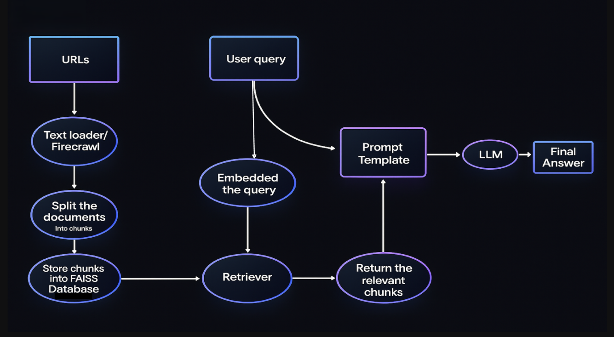
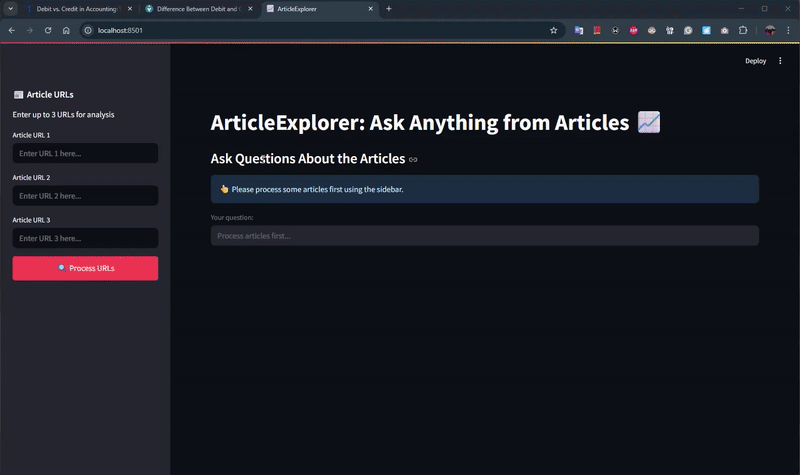

# ArticleExplorer

[](https://streamlit.io/)
[](https://www.python.org/downloads/release/python-3100/)
[](https://python.langchain.com/)
[](https://huggingface.co/)
[](https://github.com/facebookresearch/faiss)
[](https://firecrawel.com/)
[](LICENSE)


An intelligent article exploration assistant powered by LangChain, Hugging Face, and FAISS. Process any articles and ask questions to get insights using state-of-the-art language models and vector search technology.

## 🌟 Features

- 📰 Process multiple articles simultaneously
- 🧠 Advanced text embeddings using Hugging Face's `all-mpnet-base-v2`
- � Efficient vector search with Facebook AI's FAISS
- 🔗 Robust Q&A pipeline built with LangChain
- 🎯 Get precise answers with source citations
- 🚀 Modern, responsive UI with Streamlit
- 📊 Real-time progress tracking
- 🎨 Clean, minimal design

## 🔄 Workflow

Here's how ArticleExplorer processes and analyzes articles:



## 🧪 Technical Stack

### Core Technologies
- **Web Scraping**: [Firecrawel](https://firecrawel.com)
  - Advanced web scraping and content extraction
  - Efficient handling of dynamic web content
  - Clean article extraction capabilities

- **Vector Search**: [FAISS (Facebook AI Similarity Search)](https://github.com/facebookresearch/faiss)
  - Efficient similarity search and clustering of dense vectors
  - Optimized for fast retrieval of relevant article segments

- **Text Embeddings**: [Hugging Face Sentence Transformers](https://huggingface.co/sentence-transformers)
  - Model: `sentence-transformers/all-mpnet-base-v2`
  - State-of-the-art text embeddings for semantic search
  - Optimized for article similarity and retrieval

- **LangChain Integration**:
  - `RetrievalQAWithSourcesChain` for structured Q&A
  - Document loading and text splitting
  - Vector store management and retrieval
  - LLM chain orchestration

### Processing Pipeline
1. Article Processing:
   - Text extraction and cleaning
   - Chunking with `RecursiveCharacterTextSplitter`
   - Embedding generation with Sentence Transformers

2. Vector Search:
   - FAISS indexing for fast similarity search
   - Efficient storage and retrieval of article embeddings
   - Source tracking for answer attribution

3. Question Answering:
   - Semantic search using FAISS
   - Context retrieval and aggregation
   - LLM-powered answer generation with sources

## 🎥 Demo

Watch ArticleExplorer in action:


*A quick demo showing article processing and Q&A capabilities*

## 🔧 Installation

1. Clone the repository:
```bash
git clone https://github.com/hussin-sobhy/article-explorer
cd article-explorer
```

2. Set up your environment:

   **Option A: Using Conda (Recommended)**
   ```bash
   # Create and activate conda environment
   conda create -n article-explorer python=3.10
   conda activate article-explorer

   # Install dependencies
   pip install -r requirements.txt
   ```

   **Option B: Using Python venv**
   ```bash
   # Create and activate virtual environment
   python -m venv venv
   source venv/bin/activate  # On Windows, use: venv\Scripts\activate

   # Install dependencies
   pip install -r requirements.txt
   ```

3. Verify Installation:
```bash
python -c "import streamlit; import langchain; print('Setup successful!')"
```

## ⚙️ Configuration

1. Create a `.env` file in the project root:
```bash
touch .env
```

2. Add your API keys to the `.env` file:
```env
FIRECRAWL_API_KEY=your_firecrawl_api_key_here
GROQ_API_KEY=your_groq_api_key_here
```

## 🚀 Usage

1. Start the Streamlit application:
```bash
streamlit run main.py
```

2. Enter up to 3 article URLs in the sidebar.

3. Click "Process URLs" to analyze the articles.

4. Ask questions about the processed articles in the main interface.

## 🛠️ Development

The project is organized into three main modules:

- `main.py`: Application orchestration and coordination
- `processing.py`: Business logic and data processing
- `ui.py`: Streamlit UI components and styling

### Project Structure
```
article-explorer/
├── main.py
├── processing.py
├── ui.py
├── requirements.txt
├── .env
├── images/
│   └── video_gif.gif
└── README.md
```

## 🤝 Contributing

1. Fork the repository
2. Create a feature branch (`git checkout -b feature/amazing-feature`)
3. Commit your changes (`git commit -m 'Add amazing feature'`)
4. Push to the branch (`git push origin feature/amazing-feature`)
5. Open a Pull Request


Made with ❤️ using [Streamlit](https://streamlit.io), [LangChain](https://langchain.com), and [FirecrawlApp](https://firecrawl.co)
