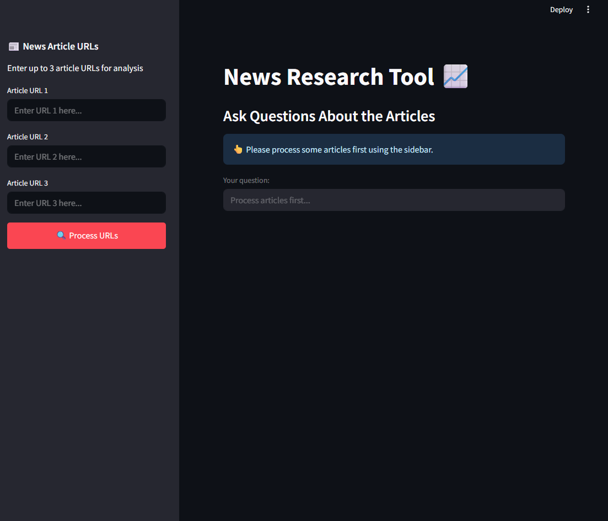
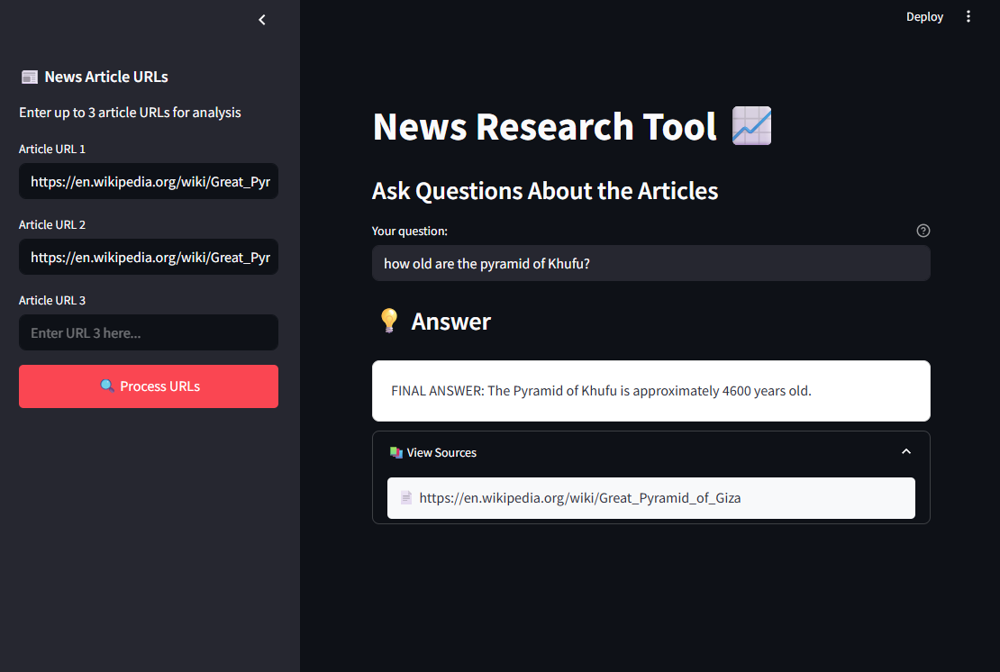

# News Research Tool 📈

[](https://streamlit.io)
[](https://www.python.org)
[](LICENSE)

An intelligent news research assistant powered by LangChain and Streamlit. Process multiple news articles and ask questions to get insights using advanced language models.

## 🌟 Features

- 📰 Process multiple news articles simultaneously
- 🔍 Extract and analyze content using FirecrawlApp
- 💡 Ask questions about the processed articles
- 🎯 Get precise answers with source citations
- 🚀 Modern, responsive UI with Streamlit
- 📊 Progress tracking and status updates
- 🎨 Clean, minimal design

## 📸 Demo & Screenshots

Here's how the application looks and works:

### Main Dashboard

*The main interface where you can input article URLs and start processing*

### Query Results

*Example of a query result with answer and sources*

## 🔧 Installation

1. Clone the repository:
```bash
git clone https://github.com/hussinxx700/news_research_tool
cd news_research_tool
```

2. Set up your environment:

   **Option A: Using Conda (Recommended)**
   ```bash
   # Create and activate conda environment
   conda create -n news-research python=3.10
   conda activate news-research

   # Install dependencies
   pip install -r requirements.txt
   ```

   **Option B: Using Python venv**
   ```bash
   # Create and activate virtual environment
   python -m venv venv
   source venv/bin/activate  # On Windows, use: venv\Scripts\activate

   # Install dependencies
   pip install -r requirements.txt
   ```

3. Verify Installation:
```bash
python -c "import streamlit; import langchain; print('Setup successful!')"
```

## ⚙️ Configuration

1. Create a `.env` file in the project root:
```bash
touch .env
```

2. Add your API keys to the `.env` file:
```env
FIRECRAWL_API_KEY=your_firecrawl_api_key_here
GROQ_API_KEY=your_groq_api_key_here
```

## 🚀 Usage

1. Start the Streamlit application:
```bash
streamlit run main.py
```

2. Enter up to 3 news article URLs in the sidebar.

3. Click "Process URLs" to analyze the articles.

4. Ask questions about the processed articles in the main interface.

## 🛠️ Development

The project is organized into three main modules:

- `main.py`: Application orchestration and coordination
- `processing.py`: Business logic and data processing
- `ui.py`: Streamlit UI components and styling

### Project Structure
```
news_research_tool/
├── main.py
├── processing.py
├── ui.py
├── requirements.txt
├── .env
├── images/
│   ├── dashboard.png
│   └── query_result.png
└── README.md
```

## 🤝 Contributing

1. Fork the repository
2. Create a feature branch (`git checkout -b feature/amazing-feature`)
3. Commit your changes (`git commit -m 'Add amazing feature'`)
4. Push to the branch (`git push origin feature/amazing-feature`)
5. Open a Pull Request


Made with ❤️ using [Streamlit](https://streamlit.io), [LangChain](https://langchain.com), and [FirecrawlApp](https://firecrawl.co)
